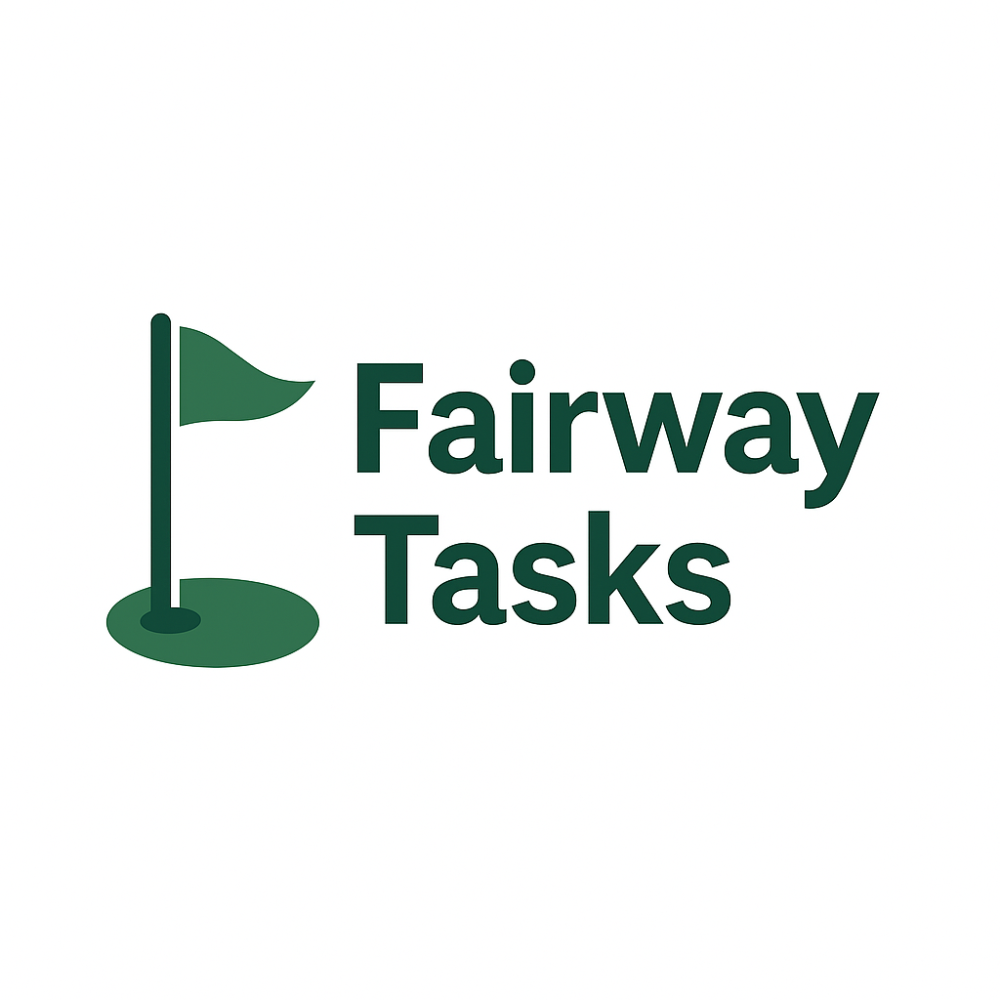

# Fairway Tasks ⛳

Fairway Tasks is a real-time, collaborative to-do list application built with
modern web technologies. It demonstrates the power of Deno, the Fresh web
framework, Deno KV for persistence, and Server-Sent Events (SSE) for instant
updates across connected clients.



<!-- Assuming logo.svg is in the static folder -->

<!-- TODO: Add a screenshot or GIF of the application in action -->
<!-- [Insert Screenshot/GIF Here] -->

## ✨ Features

- **Create & View Tasks:** Easily add new tasks and see the current list.
- **Real-time Collaboration:** Changes made by one user are instantly reflected
  for all connected users via Server-Sent Events (SSE).
- **Persistent Storage:** Tasks are saved using Deno's built-in Key-Value store
  (Deno KV).
- **Simple & Fast:** Built with Deno and Fresh for optimal performance and
  developer experience.
- **Island Architecture:** Uses Fresh's Islands Architecture for selective
  client-side hydration, keeping most of the site static.

## 🚀 Technology Stack

- **Runtime:** [Deno](https://deno.land/)
- **Framework:** [Fresh](https://fresh.deno.dev/)
- **Database:** [Deno KV](https://deno.land/manual@v1.37.1/runtime/kv)
- **Real-time:** Server-Sent Events (SSE)
- **Language:** TypeScript
- **Styling:** [Tailwind CSS](https://tailwindcss.com/) (via Fresh plugin/setup)

## 📋 Prerequisites

- [Deno](https://deno.land/#installation) (version 1.30 or later recommended for
  stable Deno KV)

## ⚙️ Setup & Installation

1. **Clone the repository:**
   ```bash
   git clone https://github.com/kofno/fairway-tasks.git
   cd fairway-tasks
   ```

2. **(Optional) Update Dependencies:** While not always necessary, you can
   update dependencies using:
   ```bash
   deno cache --reload main.ts # Or dev.ts if that's your entry point
   ```

## ▶️ Running the Project

1. **Start the development server:** Fresh projects typically use a Deno task
   defined in `deno.json` or `deno.jsonc`. The standard command is:
   ```bash
   deno task start
   ```
   This command usually handles running the `dev.ts` script which watches for
   file changes and restarts the server automatically. It also typically
   includes the necessary permissions (`--allow-net`, `--allow-read`,
   `--allow-write` for KV, potentially `--allow-env`).

2. **Open your browser:** Navigate to `http://localhost:8000` (or the port
   specified in your `dev.ts`/`main.ts`).

You should now see the Fairway Tasks application running! Open multiple browser
tabs or windows to the same address to see the real-time collaboration in
action.

## 🤝 Contributing

Contributions are welcome! Please feel free to open an issue or submit a pull
request.

1. Fork the Project
2. Create your Feature Branch (`git checkout -b feature/AmazingFeature`)
3. Commit your Changes (`git commit -m 'Add some AmazingFeature'`)
4. Push to the Branch (`git push origin feature/AmazingFeature`)
5. Open a Pull Request

## 📄 License

Distributed under the MIT License. See `LICENSE` file for more information (if
applicable).
